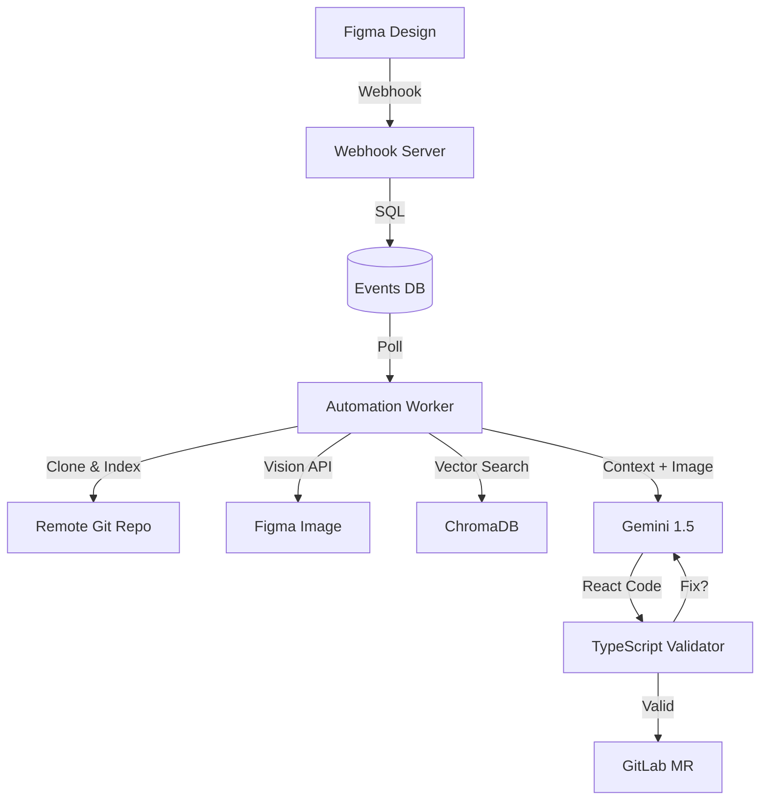

# LogicPatch Automation 🚀


**LogicPatch** is an advanced AI-powered pipeline that converts Figma designs into production-ready React code automatically.

## ✨ Key Features
- **Real-time Sync:** Detects Figma changes via Webhooks or Polling.
- **AI-Powered:** Uses Gemini 2.0 to understand design intent.
- **Self-Healing:** Validates generated code and fixes errors automatically.
- **Visual RAG:** Uses computer vision to match design aesthetics.
ng Vision AI, and creates GitLab Merge Requests automatically.

---

## ✨ Features

### 🧠 **The "Brain" (Gemini 1.5 + Vision)**
*   **Vision-Enhanced Coding:** Doesn't just guess from names. It *looks* at the design screenshot to perfect layouts, padding, and alignment.
*   **Vector Search (RAG):** Uses `ChromaDB` to index your massive codebase. Instead of "context limit errors," it finds the exact 15 files it needs to understand your project structure.
*   **Self-Healing Loop:** Validates generated code before pushing. Supports both TypeScript (`tsc`) and JSX prototyping mode.

### 🛡️ **Safety & Stability**
*   **Debounce Queue:** Designers clicking wildly? No problem. The agent waits for a "Quiet Period" (30s) and only processes the final state.
*   **Git Lock System:** Updates are pushed to a dedicated `figma-pipeline` branch to prevent conflicts with your team's work.

### 🔄 **Dynamic Git Sync (CI/CD Mode)**
*   **Decoupled & Headless:** The agent doesn't need to live in your repo. It clones, indexes, and pushes to *remote* repositories defined in `.env`.
*   **Context Aware:** Instantly swaps between Frontend, Backend, or Mobile repos by simply changing the config.

---

## 🛠️ Prerequisites

*   **Python 3.10+** (for the Agent)
*   **Node.js & npm** (for `tsc` validation and Prettier)
*   **Figma Access Token** (for webhooks/vision)
*   **Google Gemini API Key** (for intelligence)
*   **GitLab Personal Access Token** (for `git` operations)

---

## 🚀 Installation

### 1. Clone & Install
```bash
# Clone this agent repo
git clone <agent-repo-url>
cd mcp-agent

# Install Python dependencies
pip install -r requirements.txt
```

### 2. Configure Environment `.env`
Create a `.env` file based on `.env.example`:

```ini
# ============================================================
# FIGMA INTEGRATION
# ============================================================
FIGMA_ACCESS_TOKEN=figd_...
FIGMA_TEAM_ID=your_team_id
FIGMA_FILE_KEY=your_file_key
FIGMA_WEBHOOK_PASSCODE=secret_123

# ============================================================
# GITLAB AUTOMATION
# ============================================================
GITLAB_URL=https://gitlab.com
GITLAB_TOKEN=glpat_...
GITLAB_PROJECT_ID=123
GITLAB_REPO_URL="https://gitlab.com/your-org/your-frontend.git"
GITLAB_BRANCH="main"
REPO_SUB_DIR="src"

# ============================================================
# AI / LLM
# ============================================================
GEMINI_API_KEY=AIzaSy...

# ============================================================
# SECURITY & DEVELOPMENT
# ============================================================
MCP_APPROVAL_SECRET=dev-secret-change-in-prod
MCP_AUTO_APPROVE=true
DEV_ALLOW_ALL_REPOS=true

# ============================================================
# INFRASTRUCTURE (Optional)
# ============================================================
TUNNEL_TOKEN="your_cloudflare_tunnel_token"

# ============================================================
# FILE RESOLUTION
# ============================================================
SEARCH_ROOT="."  # Repository root to search for existing files
# New files are created in FigmaDesign/ folder
```

---

## 🏃‍♂️ Usage

### 1. Start Network Tunnel
Required to let Figma send events to your local machine.

**Option A: Cloudflare Tunnel (Recommended for Static URL)**
1.  Download `cloudflared` (or run `winget install Cloudflare.Cloudflared`).
2.  Start the tunnel:
    ```bash
    cloudflared tunnel --url http://localhost:8000
    ```
3.  Copy the URL (e.g., `https://random-name.trycloudflare.com`).

**Option B: ngrok (Alternative)**
```bash
ngrok http 8000
```

### 2. Start the Webhook Server
This listens for events from Figma.
```bash
python webhook_server.py
# Listening on http://0.0.0.0:8000
```

### 3. Register the Webhook
Tell Figma where to send events using your ngrok URL.
```bash
python scripts/register_webhook.py --url https://<your-ngrok-url>
```

### 4. Start the Automation Worker ("The Brain")
This runs the background daemon (Queue -> Vision -> Code -> Git).
```bash
python automation_worker.py
```
> **Note:** On first run, it will say `📚 Indexing ... files`. This is normal. It's building the Vector Map of your remote repo.

### 5. Trigger an Update
*   **Comment-Based (Recommended):** In Figma, select a frame, press **C** (Comment tool), and type `!sync`.
*   **Simulation:** Run `python scripts/simulate_webhook.py` to inject a test event.

---

## 🚀 Quick Start (One Command)

Use the all-in-one startup script:
```bash
.\start_logicpatch.bat
```
This automatically:
1. Starts ngrok tunnel
2. Registers the webhook with Figma
3. Starts webhook server and worker

---

## 🧘 Troubleshooting

*   **"Worker Stuck Indexing":** The first index of a large repo can take 1-2 minutes.
*   **"Vision Failed (404)":** Ensure your Figma Token has access to the design file.
*   **"Compiler Error Loop":** Check `mcp_core/utils/validator.py` settings. It tries to auto-fix 2 times before aborting to protect the build.
=======
# MCP Repository Tools Server 🚀

A production-grade **Model Context Protocol (MCP)** server enabling AI agents to securely interact with local codebases and automate design-to-code workflows.

## ✨ Features

### 🛠️ Core Capabilities
*   **Deep File Search**: Multi-line code search with regex support.
*   **Git Integration**: Safely create branches and manage version control.
*   **Secure Operations**: "Read-only by default" with approval token system for writes.
*   **Audit Logging**: SOC2-ready logging of all operations to `mcp_audit.jsonl`.

### 🎨 Figma Automation Suite
*   **Event Inbox Pattern**: Captures Figma webhooks in real-time (`webhook_server.py`) and stores them in a local SQLite database (`events.db`).
*   **Smart Fetching**: Optimizes Figma API calls (using `depth=2`) to handle large files without rate-limiting.
*   **Auto-PR Worker**: A background daemon (`automation_worker.py`) that:
    1.  Detects design changes.
    2.  Generates React + Tailwind code.
    3.  **Automatically opens a GitHub Draft PR**.

---

## 🚀 Getting Started

### 1. Installation
Clone the repo and install dependencies:
```bash
git clone https://git.khired.pk/logicpatch/frontend/app.git
cd app
pip install -r requirements.txt
```

### 2. Configuration (`.env`)
Create a `.env` file in the root with the following keys:

```ini
# --- Core Security ---
MCP_APPROVAL_SECRET=your-dev-secret-key-123
MCP_AUTO_APPROVE=true         # Set 'false' for stricter security

# --- Figma Integration ---
FIGMA_ACCESS_TOKEN=figd_your_token_here
FIGMA_WEBHOOK_PASSCODE=your_webhook_secret

# --- GitHub Automation ---
GITHUB_TOKEN=your_personal_access_token
GITHUB_REPO=username/repo_name

# --- Access Control ---
ALLOWED_ORIGINS=*
```

### 3. Running the Pipeline

**A. Start the Core MCP Server (for Claude)**
```bash
# Recommended for testing with Inspector
npx -y @modelcontextprotocol/inspector python -m mcp_server

# Or for production usage with Claude Desktop
python -m mcp_server
```

**B. Start the Webhook Listener (The "Ears")**
```bash
python webhook_server.py
# Listens on http://0.0.0.0:8000/figma-webhook
```

**C. Start the Automation Worker (The "Brain")**
```bash
python automation_worker.py
# Polls for events and creates PRs
```

---

## 📚 Tools Reference

### MCP Tools (Exposed to Claude)
| Tool | Description |
| :--- | :--- |
| `list_repo_files` | Explore directory structure. |
| `read_file` | Read content of files. |
| `list_pending_events` | Check the inbox for new Figma updates. |
| `fetch_figma_pattern` | Download design nodes from Figma (optimized). |
| `generate_react_code` | Convert design nodes to React/Tailwind. |
| `save_code_file` | Save generated code to disk (Write protected). |
| `create_branch` | Create a Git branch (Write protected). |
>>>>>>> d06dac19010c3e2f3fff8aa92dad6ccd137cd9b7

---

## 🏗️ Architecture

<<<<<<< HEAD


=======
The system is composed of three independent parts:

1.  **Core MCP Server** (`mcp_server.py`): The interface for the AI agent.
2.  **Webhook Receiver** (`webhook_server.py`): A standalone FastAPI app that ingests webhooks.
3.  **Automation Worker** (`automation_worker.py`): An async daemon that processes the inbox queue.

**Data Flow:**
`Figma Webhook` -> `Webhook Server` -> `SQLite DB` -> `Automation Worker` -> `GitHub PR`

---

## 📝 License
Proprietary / Internal Use Only.
>>>>>>> d06dac19010c3e2f3fff8aa92dad6ccd137cd9b7
