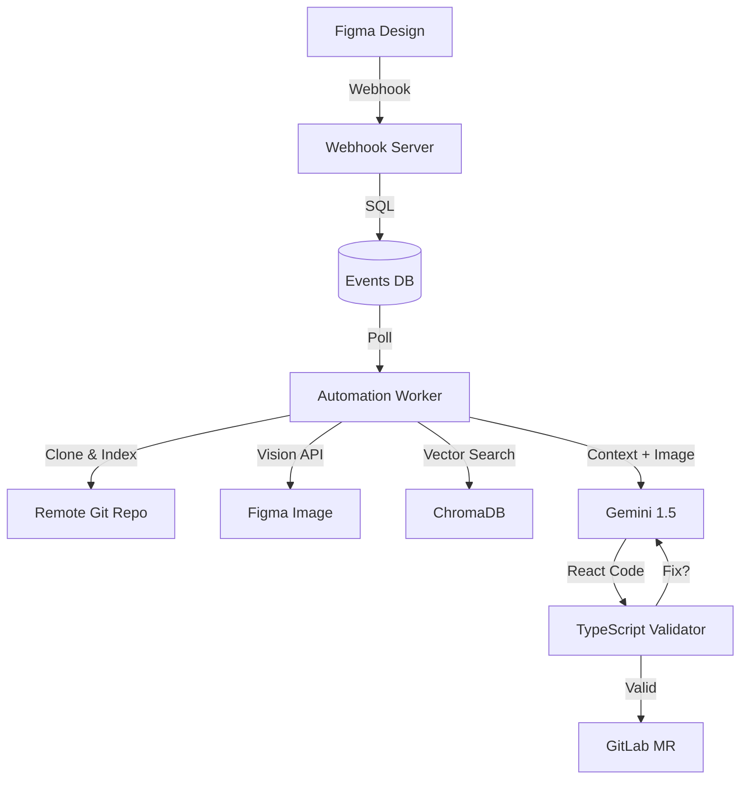

# 🤖 Figma-to-React Autonomous Agent (Gemini Edition)

A state-of-the-art **Headless Software Engineer** that monitors Figma files, understands designs using Computer Vision, and autonomously writes production-grade React code into *any* Git repository.


---

## ✨ Features

### 🧠 **The "Brain" (Gemini 1.5 + Vision)**
*   **Vision-Enhanced Coding:** Doesn't just guess from names. It *looks* at the design screenshot to perfect layouts, padding, and alignment.
*   **Vector Search (RAG):** Uses `ChromaDB` to index your massive codebase. Instead of "context limit errors," it finds the exact 15 files it needs to understand your project structure.
*   **Self-Healing Loop:** Validates generated code before pushing. Supports both TypeScript (`tsc`) and JSX prototyping mode.

### 🛡️ **Safety & Stability**
*   **Debounce Queue:** Designers clicking wildly? No problem. The agent waits for a "Quiet Period" (30s) and only processes the final state.
*   **Git Lock System:** Updates are pushed to a dedicated `figma-pipeline` branch to prevent conflicts with your team's work.

### 🔄 **Dynamic Git Sync (CI/CD Mode)**
*   **Decoupled & Headless:** The agent doesn't need to live in your repo. It clones, indexes, and pushes to *remote* repositories defined in `.env`.
*   **Context Aware:** Instantly swaps between Frontend, Backend, or Mobile repos by simply changing the config.

---

## 🛠️ Prerequisites

*   **Python 3.10+** (for the Agent)
*   **Node.js & npm** (for `tsc` validation and Prettier)
*   **Figma Access Token** (for webhooks/vision)
*   **Google Gemini API Key** (for intelligence)
*   **GitLab Personal Access Token** (for `git` operations)

---

## 🚀 Installation

### 1. Clone & Install
```bash
# Clone this agent repo
git clone <agent-repo-url>
cd mcp-agent

# Install Python dependencies
pip install -r requirements.txt
```

### 2. Configure Environment `.env`
Create a `.env` file based on `.env.example`:

```ini
# ============================================================
# FIGMA INTEGRATION
# ============================================================
FIGMA_ACCESS_TOKEN=figd_...
FIGMA_TEAM_ID=your_team_id
FIGMA_FILE_KEY=your_file_key
FIGMA_WEBHOOK_PASSCODE=secret_123

# ============================================================
# GITLAB AUTOMATION
# ============================================================
GITLAB_URL=https://gitlab.com
GITLAB_TOKEN=glpat_...
GITLAB_PROJECT_ID=123
GITLAB_REPO_URL="https://gitlab.com/your-org/your-frontend.git"
GITLAB_BRANCH="main"
REPO_SUB_DIR="src"

# ============================================================
# AI / LLM
# ============================================================
GEMINI_API_KEY=AIzaSy...

# ============================================================
# SECURITY & DEVELOPMENT
# ============================================================
MCP_APPROVAL_SECRET=dev-secret-change-in-prod
MCP_AUTO_APPROVE=true
DEV_ALLOW_ALL_REPOS=true

# ============================================================
# INFRASTRUCTURE (Optional)
# ============================================================
TUNNEL_TOKEN="your_cloudflare_tunnel_token"
```

---

## 🏃‍♂️ Usage

### 1. Start Network Tunnel
Required to let Figma send events to your local machine.

**Option A: Cloudflare Tunnel (Recommended for Static URL)**
1.  Download `cloudflared` (or run `winget install Cloudflare.Cloudflared`).
2.  Start the tunnel:
    ```bash
    cloudflared tunnel --url http://localhost:8000
    ```
3.  Copy the URL (e.g., `https://random-name.trycloudflare.com`).

**Option B: ngrok (Alternative)**
```bash
ngrok http 8000
```

### 2. Start the Webhook Server
This listens for events from Figma.
```bash
python webhook_server.py
# Listening on http://0.0.0.0:8000
```

### 3. Register the Webhook
Tell Figma where to send events using your ngrok URL.
```bash
python scripts/register_webhook.py --url https://<your-ngrok-url>
```

### 4. Start the Automation Worker ("The Brain")
This runs the background daemon (Queue -> Vision -> Code -> Git).
```bash
python automation_worker.py
```
> **Note:** On first run, it will say `📚 Indexing ... files`. This is normal. It's building the Vector Map of your remote repo.

### 5. Trigger an Update
*   **Real World:** Make a change in Figma.
*   **Simulation:** Run `python scripts/simulate_webhook.py` to inject a test event.

---

## 🧘 Troubleshooting

*   **"Worker Stuck Indexing":** The first index of a large repo can take 1-2 minutes.
*   **"Vision Failed (404)":** Ensure your Figma Token has access to the design file.
*   **"Compiler Error Loop":** Check `mcp_core/utils/validator.py` settings. It tries to auto-fix 2 times before aborting to protect the build.

---

## 🏗️ Architecture



