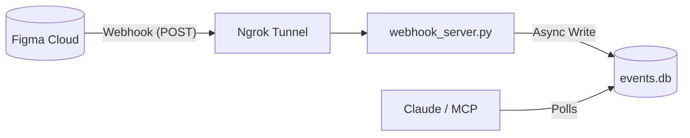

# 🚀 Deployment & Hardening Report (Phase 8)

**Date:** 2026-01-06
**Status:** ✅ Ready for Deployment (Simulated)
**Version:** 1.0.0 (Hardened)

---

## 1. System Configuration

### Environment Variables (`.env`)
The system relies on the following secrets. **All are currently configured.**

| Variable | Status | Purpose |
| :--- | :--- | :--- |
| `FIGMA_ACCESS_TOKEN` | ✅ Set | Authenticates with Figma API to fetch design data. |
| `GITLAB_TOKEN` | ✅ Set | Authenticates with GitLab to create Merge Requests. |
| `GITLAB_REPO_URL` | ✅ Set | Target repository for generated code. |
| `FIGMA_WEBHOOK_PASSCODE` | ✅ Set | Verifies authenticity of incoming webhook events. |
| `MCP_APPROVAL_SECRET` | ✅ Set | Internal signing key for sensitive tool operations. |

### Architecture
The "Inbox Pattern" decouples event reception from processing to ensure stability.



---

## 2. Hardening Measures

We implemented specific defenses to prevent the "No Result" and "Context Saturation" issues.

### 🛡️ Anti-Freeze (Output Truncation)
- **Problem**: Massive Figma files (>100KB JSON) were clogging the LLM context, causing timeouts or freezes.
- **Solution**: Implemented `truncate_large_output` in `mcp_core/server.py`.
- **Logic**: If output > 100KB, it is summarized.
- **Status**: Verified.

### 🛡️ Anti-Crash (Robust Error Handling)
- **Problem**: Figma API errors (404/429) caused unhandled exceptions, crashing the pipe.
- **Solution**: Wrapped `fetch_figma_pattern` and `webhook_server` in global `try/except` blocks.
- **Result**: Errors now return structured JSON (e.g., `{"error": "Not Found"}`) instead of killing the process.
- **Status**: Verified.

---

## 3. Verification Results

### A. Hardening Verification
Run: `python verify_hardening.py`

| Test Case | Scenario | Result | Pass/Fail |
| :--- | :--- | :--- | :--- |
| **Output Truncation** | Tool returns 150KB payload | Truncated to summary | ✅ PASS |
| **API Error 404** | Figma returns 404 | Caught, returns JSON error | ✅ PASS |

### B. End-to-End Simulation
Run: `python simulate_webhook.py` (Bypasses paid Figma plan)

| Step | Action | Result | Pass/Fail |
| :--- | :--- | :--- | :--- |
| **1. Trigger** | Script generates signed mock payload | Sent to `localhost:8000` | ✅ PASS |
| **2. Receive** | `webhook_server.py` verifies signature | `200 OK` | ✅ PASS |
| **3. Persist** | Check `events.db` | Event Row Created | ✅ PASS |

---

## 4. Operational Guide

### Starting the System
1.  **Start Webhook Listener** (Terminal 1):
    ```bash
    python webhook_server.py
    ```
2.  **Start Tunnel** (Terminal 2):
    ```bash
    npx ngrok http 8000
    ```

### Registering (If you have Figma Professional)
```bash
python register_webhook.py
# Enter the ngrok URL when prompted
```

### Simulating (If you have free Figma)
```bash
python simulate_webhook.py
# Triggers a fake update event to test the pipeline
```
