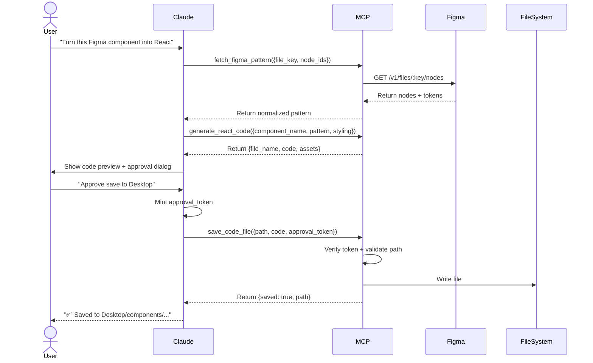

# ADR 004: Figma to React Code Generation Pipeline

**Date:** 2025-12-23  
**Status:** Accepted  
**Extends:** ADR 003 (approval tokens for write operations)

---

## Context

Design-to-code automation is a common workflow where AI transforms visual designs (Figma) into production-ready code (React). This ADR defines how our MCP server enables this workflow securely while respecting our existing security model from ADR 003.

**User Story:**
> As a developer, I want Claude to fetch my Figma design components and generate React code, then save the output to my local workspace with approval gates for write operations.

---

## Decision

### 1. Three-Tool Pipeline

**Read Operations** (no approval required):
1. **`fetch_figma_pattern`**: Fetch design data from Figma REST API
2. **`generate_react_code`**: Transform Figma data into React code (dry-run)

**Write Operation** (approval token required):
3. **`save_code_file`**: Persist generated code to filesystem

### 2. Figma API Integration

**Authentication:**
```python
FIGMA_ACCESS_TOKEN=<user-personal-access-token>
```

**Scopes Required:**
- `file_content:read` - Read file nodes and properties

**API Endpoints Used:**
- `GET /v1/files/:key` - Fetch file metadata
- `GET /v1/files/:key/nodes?ids=:node_ids` - Fetch specific nodes
- `GET /v1/images/:key?ids=:node_ids&format=svg` - Export assets (optional)

### 3. Tool Specifications

#### fetch_figma_pattern (Read-Only)

**Purpose:** Normalize Figma design data for code generation.

**Input:**
```json
{
  "file_key": "ABC123xyz",
  "node_ids": ["1:2", "1:3"],
  "include_tokens": true,
  "depth": 3
}
```

**Output:**
```json
{
  "file_key": "ABC123xyz",
  "name": "Design System",
  "last_modified": "2025-12-23T10:00:00Z",
  "nodes": [
    {
      "id": "1:2",
      "type": "COMPONENT",
      "name": "Button/Primary",
      "props": {
        "width": 120,
        "height": 40,
        "borderRadius": 8,
        "fills": [{"type": "SOLID", "color": {"r": 0.2, "g": 0.4, "b": 0.8}}]
      },
      "children": [...]
    }
  ],
  "tokens": {
    "colors": {"primary": "#3366CC"},
    "spacing": {"md": 16}
  }
}
```

**Implementation Notes:**
- Normalize Figma's nested structure into flat component list
- Extract design tokens (colors, spacing, typography)
- Handle component variants (Default, Hover, Disabled states)

---

#### generate_react_code (Read-Only)

**Purpose:** AI-driven code generation from normalized Figma data.

**Input:**
```json
{
  "component_name": "PrimaryButton",
  "pattern": {...},  // From fetch_figma_pattern output
  "language": "tsx",
  "styling": "tailwind",
  "props_strategy": "explicit"
}
```

**Output:**
```json
{
  "file_name": "PrimaryButton.tsx",
  "code": "import React from 'react';\n\ninterface Props {...}\n\nexport const PrimaryButton = ({...}: Props) => {...}",
  "imports": ["react"],
  "assets": [
    {
      "name": "icon-chevron.svg",
      "type": "svg",
      "bytes": "PHN2ZyB4bWxucz0i..."
    }
  ]
}
```

**Styling Strategies:**
- `tailwind`: Use Tailwind CSS classes
- `css-modules`: Generate `.module.css` file
- `styled-components`: Use styled-components library
- `emotion`: Use @emotion/styled
- `mui`: Use Material-UI components

**Props Strategies:**
- `minimal`: Only essential props (children, onClick)
- `explicit`: All variant props (size, variant, disabled)
- `tokens-as-props`: Expose design tokens as props (color, spacing)

---

#### save_code_file (Write, Approval Required)

**Purpose:** Persist generated code to local filesystem with security gates.

**Input:**
```json
{
  "output_path": "C:\\Users\\user\\Desktop\\components",
  "file_name": "PrimaryButton.tsx",
  "code": "...",
  "approval_token": {
    "version": 1,
    "operation": "save_code_file",
    "repo": "desktop_workspace",
    "timestamp": 1703234567,
    "nonce": "...",
    "approver_id": "user@example.com",
    "aud": "mcp-server",
    "host_id": "claude-code",
    "signature": "..."
  }
}
```

**Output:**
```json
{
  "saved": true,
  "path": "C:\\Users\\user\\Desktop\\components\\PrimaryButton.tsx",
  "bytes": 1024
}
```

**Security Checks:**
1. ✅ Approval token signature verification
2. ✅ Path containment (must be within `allowed_roots`)
3. ✅ Size cap (200KB max for code)
4. ✅ File name validation (`^[A-Za-z0-9._\-/]+$`)
5. ✅ No path traversal (`..` blocked)
6. ✅ Audit logging with `side_effects: true`

---

### 4. Security Model Alignment

**Development Mode:**
```python
allowed_roots = [
    Path.home() / "Desktop",      # ✅ Allowed in dev
    Path(__file__).parent / "exports"
]
```

**Production Mode:**
```python
allowed_roots = [
    Path("/repos/allowed/exports")  # ❌ Desktop removed in prod
]
```

**Approval Flow:**


---

### 5. Design Token Extraction

Figma stores tokens in multiple places:
1. **Variables** (Design System tokens)
2. **Styles** (Text styles, color styles)
3. **Component properties** (Component variants)

**Normalization Logic:**
```python
def extract_tokens(figma_file: dict) -> dict:
    tokens = {
        "colors": {},
        "spacing": {},
        "typography": {},
        "shadows": {}
    }
    
    # From variables
    for var in figma_file.get("variables", {}).values():
        if var["resolvedType"] == "COLOR":
            tokens["colors"][var["name"]] = rgba_to_hex(var["value"])
        elif var["resolvedType"] == "FLOAT":
            tokens["spacing"][var["name"]] = var["value"]
    
    # From styles
    for style in figma_file.get("styles", {}).values():
        if style["styleType"] == "FILL":
            tokens["colors"][style["name"]] = extract_fill(style)
        elif style["styleType"] == "TEXT":
            tokens["typography"][style["name"]] = extract_text_style(style)
    
    return tokens
```

---

### 6. Code Generation Strategy

**Component Structure (TSX):**
```tsx
import React from 'react';

interface PrimaryButtonProps {
  children: React.ReactNode;
  variant?: 'default' | 'hover' | 'disabled';
  size?: 'sm' | 'md' | 'lg';
  onClick?: () => void;
}

export const PrimaryButton: React.FC<PrimaryButtonProps> = ({
  children,
  variant = 'default',
  size = 'md',
  onClick
}) => {
  return (
    <button
      className={`btn-primary btn-${size} btn-${variant}`}
      onClick={onClick}
    >
      {children}
    </button>
  );
};
```

**Styling Generation (Tailwind example):**
```json
{
  "borderRadius": 8,
  "padding": {
    "horizontal": 16,
    "vertical": 8
  },
  "backgroundColor": "#3366CC"
}
```
↓ Transforms to:
```tsx
className="rounded-lg px-4 py-2 bg-blue-600"
```

---

## Consequences

### Positive
- **Rapid prototyping**: Figma → code in seconds
- **Design consistency**: Generated code matches designs pixel-perfect
- **Token reuse**: Design tokens automatically extracted
- **Security maintained**: Approval tokens prevent unauthorized writes

### Negative
- **Figma API dependency**: Requires valid access token
- **Code quality variance**: AI-generated code may need refinement
- **Limited to React**: TSX/JSX only (no Vue, Svelte, etc. in v1)
- **Network latency**: Figma API calls add delay

### Mitigations
- **Caching**: Cache Figma responses to reduce API calls
- **Code review**: User always previews before saving
- **Template customization**: Allow custom code templates
- **Offline mode**: Store fetched patterns locally for reuse

---

## Implementation Roadmap

### Phase 1: Read Operations (Today)
1. ✅ Add `requests` dependency for Figma API
2. ✅ Implement `fetch_figma_pattern`
   - Figma API client wrapper
   - Node normalization
   - Token extraction
3. ✅ Implement `generate_react_code`
   - Component template engine
   - Styling strategy logic
   - Props inference

### Phase 2: Write Operation (Today)
4. ✅ Implement `save_code_file`
   - Approval token integration
   - Path validation
   - Size caps
5. ✅ Audit logging with `target_ref: <file_path>`

### Phase 3: Enhancements (Later)
6. Export SVG assets from Figma
7. Generate CSS modules alongside TSX
8. Support design system tokens JSON export
9. Add GitLab/Azure DevOps for version control

---

## Configuration

### Environment Variables
```bash
# Figma API
FIGMA_ACCESS_TOKEN=figd_...  # Personal access token from Figma

# File paths (dev vs prod)
DEV_ALLOW_ALL_REPOS=true
ALLOWED_ROOTS=/Users/name/Desktop,/repos/exports  # Desktop only in dev
```

### Figma Token Generation
1. Go to Figma → Settings → Personal Access Tokens
2. Generate token with `file_content:read` scope
3. Set `FIGMA_ACCESS_TOKEN` environment variable

---

## See Also
- [ADR 003](ADR_003_Write_Operations_Security.md): Write operations security model
- [Figma API Docs](https://www.figma.com/developers/api)
- [MCP Protocol](https://modelcontextprotocol.io)
